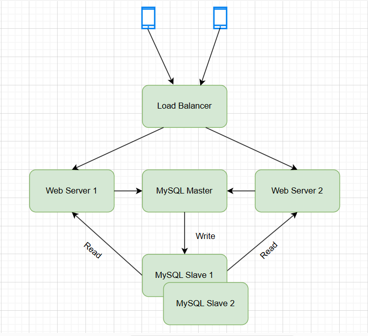

# Overview
A load‑testing sandbox for Laravel, Nginx, and MySQL, featuring web‑server load balancing and MySQL replication.

# Diagram


# Functional
- Load testing with Laravel, Nginx, MySQL, k6
- Support multiple web servers
- Support database master-slave replication

# Install (delete volumes data)
```
bash install.sh
```

# Import employees database if needed
```
bash import_db_employees.sh
```

# Access web
- Load balancer: http://localhost:9000
- Web server 1: http://localhost:9001
- Web server 2: http://localhost:9002

# Access database
- MySQL master: root / 111
- MySQL slave 1: root / 111
- MySQL slave 2: root / 111

# Load testing
#### Config CPU, RAM
```
Edit docker-compose.yml
- cpus: 2.0
- mem_limit: 3g

docker compose up -d
```

#### Config nginx
```
Edit nginx.conf
server_ubuntu1/nginx/nginx.conf
server_ubuntu2/nginx/nginx.conf

docker restart u1 u2
```

#### Config php-fpm
```
Edit nginx.conf
server_ubuntu1/php/8.1/fpm/pool.d/www.conf
server_ubuntu2/php/8.1/fpm/pool.d/www.conf

docker restart u1 u2
```

#### Edit test
```
- api: /load-test
- k6: load-test.js
```

#### Run test
```
docker run --rm -i --network docker_server_docker_server_network grafana/k6 run - <load-test.js
```